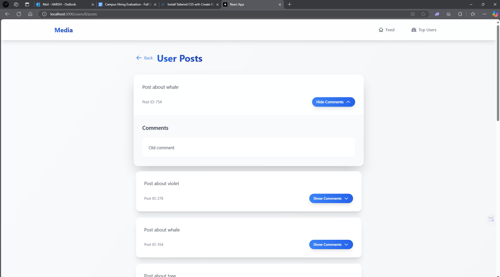
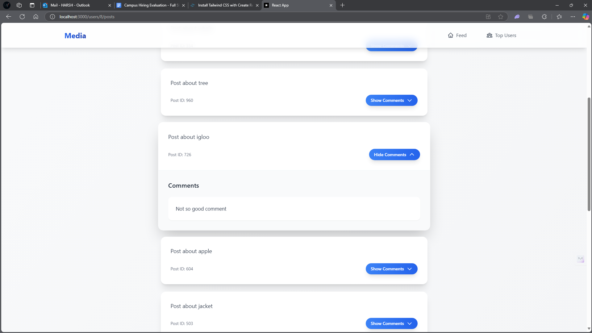

# Media Platform

## Screenshots





A modern social media platform built with React, TypeScript, and Express.js, featuring a clean and intuitive user interface.

## Features

- User authentication and registration
- Post creation and management
- Comment system
- User profiles
- Real-time updates
- Responsive design
- Modern UI with Tailwind CSS

## Code Snippets

### Backend API Implementation

```javascript
// Authentication endpoint
app.post('/auth', async (req, res) => {
    try {
        const response = await axios.post(`${EVALUATION_SERVICE_BASE_URL}/auth`, authData);
        authToken = response.data.access_token;
        res.json(response.data);
    } catch (error) {
        res.status(error.response?.status || 500).json({
            error: error.response?.data || 'Authentication failed'
        });
    }
});

// Fetch user posts
app.get('/users/:userId/posts', async (req, res) => {
    try {
        const token = await getAuthToken();
        const { userId } = req.params;
        const response = await axios.get(`${EVALUATION_SERVICE_BASE_URL}/users/${userId}/posts`, {
            headers: {
                'Authorization': `Bearer ${token}`
            }
        });
        res.json(response.data);
    } catch (error) {
        res.status(error.response?.status || 500).json({
            error: error.response?.data || 'Failed to fetch posts'
        });
    }
});
```

**Explanation:**
The backend implementation uses Express.js to create RESTful API endpoints. The authentication endpoint (`/auth`) handles user login by communicating with an external evaluation service. It stores the received access token for subsequent API calls. The posts endpoint (`/users/:userId/posts`) demonstrates protected route implementation, requiring a valid authentication token to fetch user-specific posts. Error handling is implemented using try-catch blocks to ensure graceful error responses.

### Frontend Components

```typescript
// Post Component
interface PostProps {
  id: string;
  content: string;
  author: string;
  timestamp: string;
}

const Post: React.FC<PostProps> = ({ id, content, author, timestamp }) => {
  return (
    <div className="bg-white rounded-lg shadow-md p-4 mb-4">
      <div className="flex items-center mb-2">
        <span className="font-semibold">{author}</span>
        <span className="text-gray-500 text-sm ml-2">{timestamp}</span>
      </div>
      <p className="text-gray-800">{content}</p>
      <div className="mt-4 flex space-x-4">
        <button className="text-blue-500 hover:text-blue-700">Like</button>
        <button className="text-blue-500 hover:text-blue-700">Comment</button>
      </div>
    </div>
  );
};
```

**Explanation:**
This TypeScript React component demonstrates the implementation of a reusable Post component. The `PostProps` interface defines the type structure for post data, ensuring type safety. The component uses Tailwind CSS for styling, creating a clean and modern UI with:
- A white background card with rounded corners and shadow
- Author name and timestamp display
- Post content section
- Interactive buttons for likes and comments
The component follows React best practices with proper prop typing and functional component structure.

### API Service

```typescript
// API Service for making HTTP requests
import axios from 'axios';

const API_BASE_URL = 'http://localhost:3000';

export const apiService = {
  async registerUser(userData: UserRegistrationData) {
    const response = await axios.post(`${API_BASE_URL}/register`, userData);
    return response.data;
  },

  async loginUser(credentials: LoginCredentials) {
    const response = await axios.post(`${API_BASE_URL}/auth`, credentials);
    return response.data;
  },

  async getUserPosts(userId: string) {
    const response = await axios.get(`${API_BASE_URL}/users/${userId}/posts`);
    return response.data;
  }
};
```

**Explanation:**
The API service implements a centralized approach for handling HTTP requests using Axios. It provides three main functions:
1. `registerUser`: Handles new user registration
2. `loginUser`: Manages user authentication
3. `getUserPosts`: Fetches posts for a specific user

This service layer abstracts the HTTP communication details, making it easier to:
- Maintain consistent API calls across the application
- Handle authentication headers
- Implement error handling
- Update API endpoints in one place

The service uses TypeScript interfaces (`UserRegistrationData` and `LoginCredentials`) to ensure type safety when making API calls.

## Tech Stack

### Frontend
- React
- TypeScript
- Tailwind CSS
- Axios for API calls

### Backend
- Node.js
- Express.js
- RESTful API
- Authentication service integration

## Project Structure

```
social-media/
├── client-side/          # Frontend React application
│   ├── public/          # Static assets
│   ├── src/             # Source code
│   ├── package.json     # Frontend dependencies
│   └── tailwind.config.js
│
└── server/              # Backend Express server
    ├── server.js        # Main server file
    ├── package.json     # Backend dependencies
    └── .env            # Environment variables
```

## Getting Started

### Prerequisites
- Node.js (v14 or higher)
- npm or yarn

### Installation

1. Clone the repository:
```bash
git clone
cd social-media
```

2. Install backend dependencies:
```bash
cd server
npm install
```

3. Install frontend dependencies:
```bash
cd ../client-side
npm install
```

4. Create a `.env` file in the server directory with the following variables:
```
PORT=3000
```

### Running the Application

1. Start the backend server:
```bash
cd server
npm start
```

2. Start the frontend development server:
```bash
cd client-side
npm start
```

The application will be available at `http://localhost:3000`

## API Endpoints

- `POST /register` - User registration
- `POST /auth` - User authentication
- `GET /users` - Get all users
- `GET /users/:userId/posts` - Get user's posts
- `GET /posts/:postId/comments` - Get post comments

## Contributing

1. Fork the repository
2. Create your feature branch (`git checkout -b feature/amazing-feature`)
3. Commit your changes (`git commit -m 'Add some amazing feature'`)
4. Push to the branch (`git push origin feature/amazing-feature`)
5. Open a Pull Request

## License

This project is licensed under the MIT License - see the LICENSE file for details.

## Contact

Harsh - e22cseu0810@bennett.edu.in 